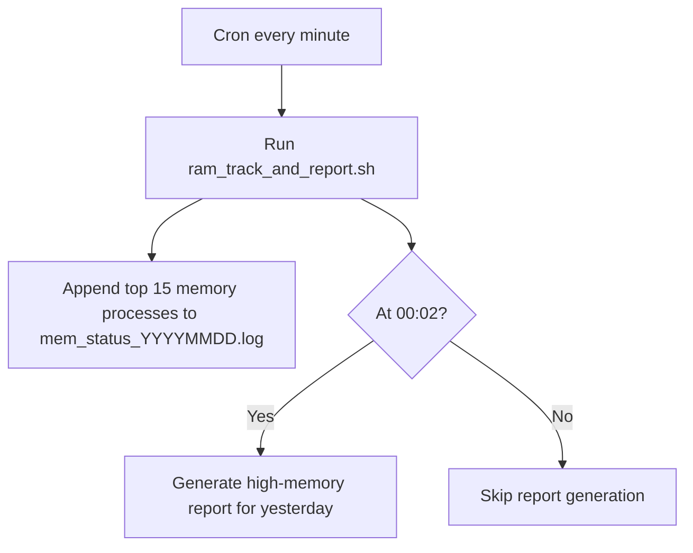

# RAM Tracking & High-Memory Process Reporting

This repository contains a Bash script to track system memory usage and generate high-memory process reports on a Linux system. It is designed to:

- Collect top memory-consuming processes every minute.
- Save daily logs in a structured format.
- Generate a report of processes consuming more than 5% memory from yesterday (excluding MySQL).
- Handle special characters, spaces, and missing directories automatically.

---

## Prerequisites

1. Linux system with Bash shell (`/bin/bash`).
2. User with sufficient permissions to run `ps` and write logs (example: `itops`).
3. Cron service installed and running.
4. Basic utilities: `awk`, `grep`, `mkdir`, `chmod`, `chown`, `date`.

---

## Quick Start

Run these commands as your `itops` user to set up everything:

```bash
# 1. Create directories
mkdir -p /home/itops/ram_tracking /home/itops/ram_logs

# 2. Set ownership and permissions
chown -R itops:itops /home/itops/ram_tracking /home/itops/ram_logs
chmod 755 /home/itops/ram_tracking /home/itops/ram_logs

# 3. Download or create the script
cat << 'EOF' > /home/itops/ram_tracking/ram_track_and_report.sh
#!/bin/bash
set -euo pipefail
set -x

BASE_DIR="/home/itops/ram_tracking"
LOG_DIR="/home/itops/ram_logs"
mkdir -p "$BASE_DIR" "$LOG_DIR"

DATE_NOW=$(date +'%Y%m%d%H%M')
DATE_TODAY=$(date +'%Y%m%d')
DATE_YESTERDAY=$(date -d "yesterday" +'%Y%m%d')

MEMLOGFILE="$LOG_DIR/mem_status_${DATE_TODAY}.log"
YESTERDAY_MEMLOG="$LOG_DIR/mem_status_${DATE_YESTERDAY}.log"
REPORTFILE="$LOG_DIR/high_mem_processes_${DATE_YESTERDAY}.log"

# Step 1: Create log file with header if missing
if [ ! -f "$MEMLOGFILE" ]; then
    echo "[$(date '+%Y-%m-%d %H:%M:%S')] Creating new log file: $MEMLOGFILE"
    ps aux | head -1 | awk -v ts="TIMESTAMP:" '{print ts, $0}' > "$MEMLOGFILE"
fi

# Step 2: Append top 15 memory-consuming processes
ps aux --sort=-%mem | head -n 16 | tail -n 15 | while IFS= read -r line; do
    echo "${DATE_NOW}: $line" >> "$MEMLOGFILE"
done

# Step 3: Generate high-memory report for yesterday (00:02 only)
CURRENT_HOUR=$(date +'%H')
CURRENT_MINUTE=$(date +'%M')

if [[ "$CURRENT_HOUR" -eq 0 && "$CURRENT_MINUTE" -eq 2 ]]; then
    if [ -f "$YESTERDAY_MEMLOG" ]; then
        echo "[$(date '+%Y-%m-%d %H:%M:%S')] Generating high-memory report from $YESTERDAY_MEMLOG"
        rm -f "$REPORTFILE" "$REPORTFILE.tmp"

        head -1 "$YESTERDAY_MEMLOG" > "$REPORTFILE"

        grep -vE "mysql|TIMESTAMP" "$YESTERDAY_MEMLOG" | \
            awk '{ if ($4+0 > 5.0) print $0 }' > "$REPORTFILE.tmp"

        awk '{for(i=11;i<=NF;i++) printf $i " "; print ""}' "$REPORTFILE.tmp" | sort -u | \
        while read -r cmd; do
            grep -F "$cmd" "$REPORTFILE.tmp" | tail -1
        done >> "$REPORTFILE"

        rm -f "$REPORTFILE.tmp"
    else
        echo "[$(date '+%Y-%m-%d %H:%M:%S')] Yesterday’s log not found: $YESTERDAY_MEMLOG — skipping report."
    fi
fi
EOF

# 4. Make script executable
chmod +x /home/itops/ram_tracking/ram_track_and_report.sh

#5.Cron Setup
Run the script every minute: crontab -e
# RAM Tracking every minute
* * * * * /home/itops/ram_tracking/ram_track_and_report.sh >> /home/itops/ram_logs/ram_tracking_cron.log 2>&1

````

---

## Directory & Workflow

```
/home/itops/
 ├─ ram_tracking/
 │    └─ ram_track_and_report.sh    # Main script
 └─ ram_logs/
      ├─ mem_status_YYYYMMDD.log    # Daily memory logs
      └─ high_mem_processes_YYYYMMDD.log  # Yesterday’s high-memory report
```

### Workflow Diagram (Mermaid)



---

## Usage

* Latest memory log:

```bash
tail -n 10 /home/itops/ram_logs/mem_status_$(date +'%Y%m%d').log
```

* Yesterday’s high-memory report:

```bash
cat /home/itops/ram_logs/high_mem_processes_$(date -d "yesterday" +'%Y%m%d').log
```

---

## Notes

1. MySQL processes are excluded from high-memory report.
2. Logs are timestamped: `YYYYMMDDHHMM`.
3. Adjust `head` or `awk` lines for more/fewer processes.
4. Ensure cron service is running to automate data collection.

---

## Author

Jibin Thomas
2025/10/24
